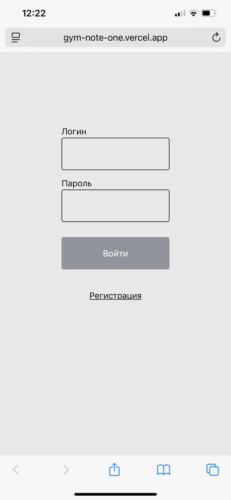
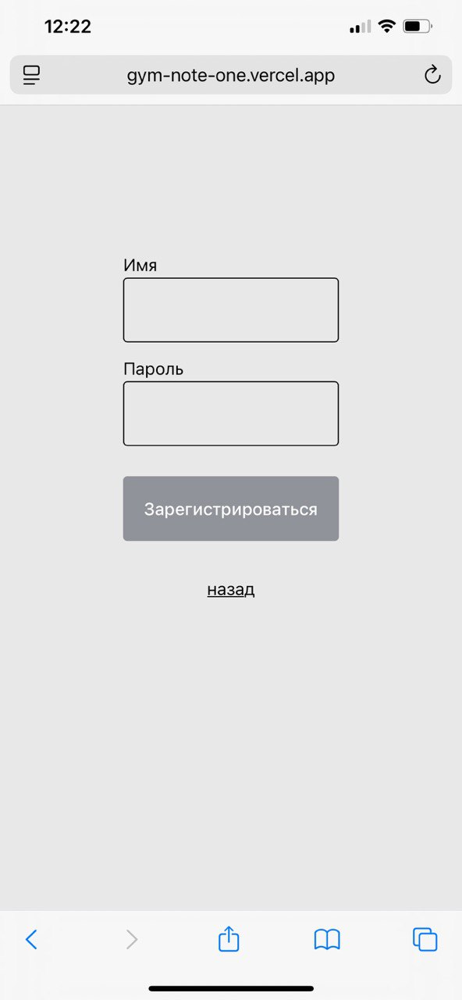
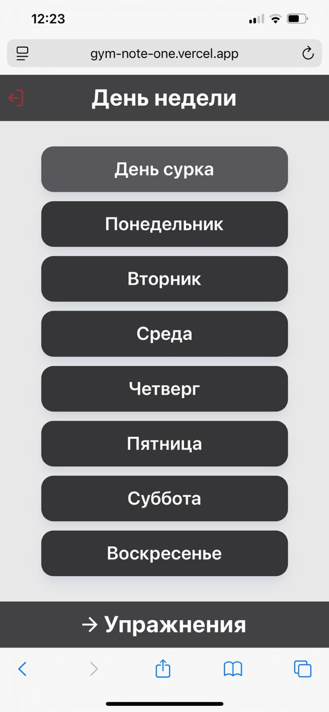
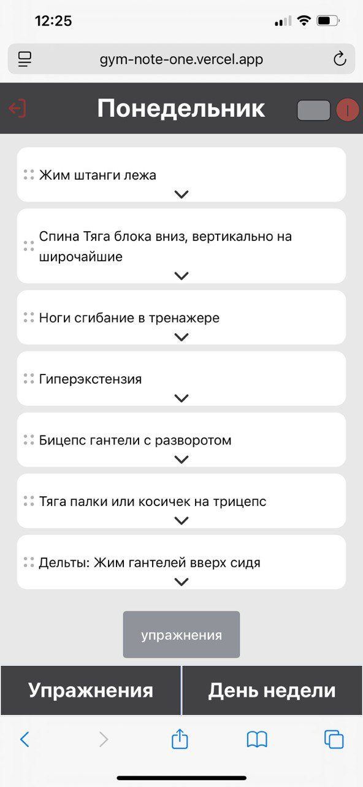
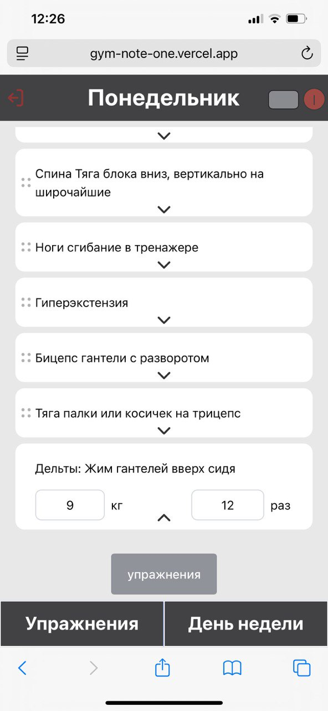
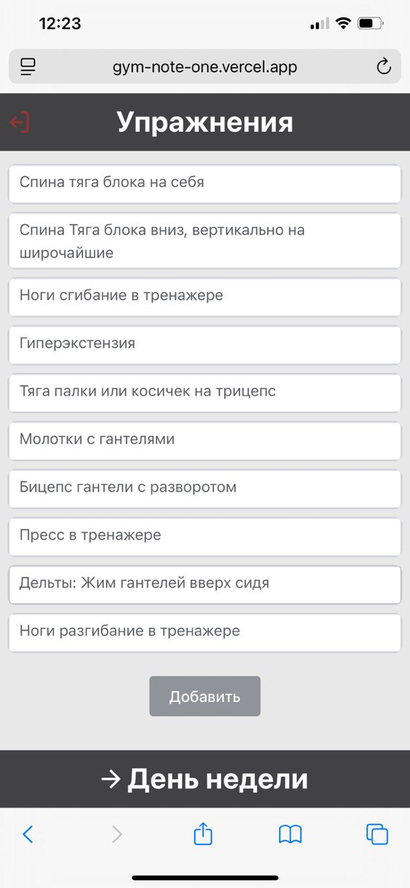
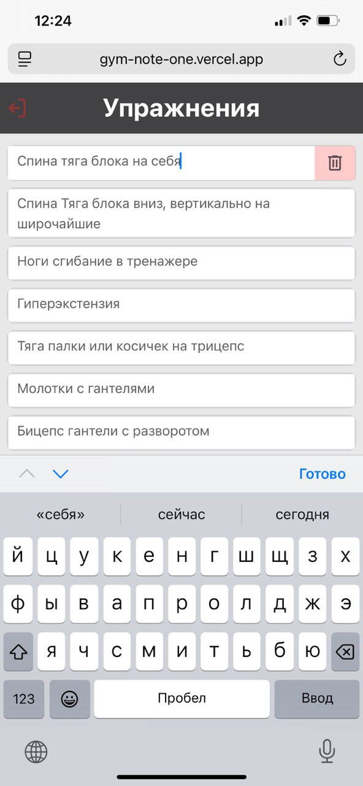

# gym-note

Приложение для отслеживания параметров упражнений (вес и т.д.)

## 📸 Скриншоты приложения

<details>
<summary>1. Страница входа</summary>


</details>

<details>
<summary>2. Страница регистрации</summary>


</details>

<details>
<summary>3. Стартовое меню</summary>


</details>

<details>
<summary>4. Выбор дня недели</summary>


</details>

<details>
<summary>5. Упражнения в выбранном дне</summary>


</details>

<details>
<summary>6. Детали упражнения (раскрытая карточка)</summary>


</details>

<details>
<summary>7. Добавление упражнений в день</summary>


</details>

<details>
<summary>8. Управление упражнениями</summary>


</details>

<details>
<summary>9. Удаление упражнения</summary>


</details>

## 🚀 Команды для работы

### Установка зависимостей
```sh
npm install
```

### Запуск локальной разработки
```sh
npm run dev
```

### Запуск сервера
```sh
node server/index.js
```

### Сборка проекта
```sh
npm run build
```

## 📁 Структура проекта

- `src/` - исходный код приложения
- `server/` - серверная часть
- `docs/screenshots/` - скриншоты интерфейса
- `public/` - статические файлы
